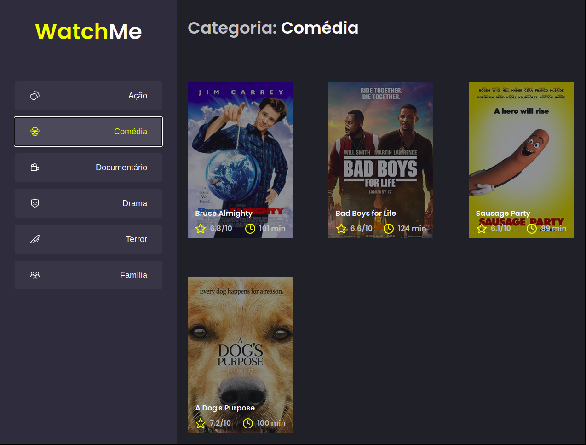

<div align="center">
  
</div>

## Sobre
Nesse desafio iremos dividir uma aplicação em componentes afim
de isolar as responsabilidades e facilitar a manutenção do código.

## Layout

<div align="center">
  
</div>

## Como usar

1. clone o repositório:
```sh
git clone https://github.com/mauriciogirardi/challenge-ignite-react-composing-the-aplication.git
```
2. Rodar aplicação:

```sh
  # entar na pasta
  $ cd challenge-ignite-react-composing-the-aplication
  
  # instalar as dependencias
  $ yarn # ou npm 

  # rodar o projeto
  $ yarn dev # ou npm dev
  
  # abra no browser
  $ localhost:8080
```
